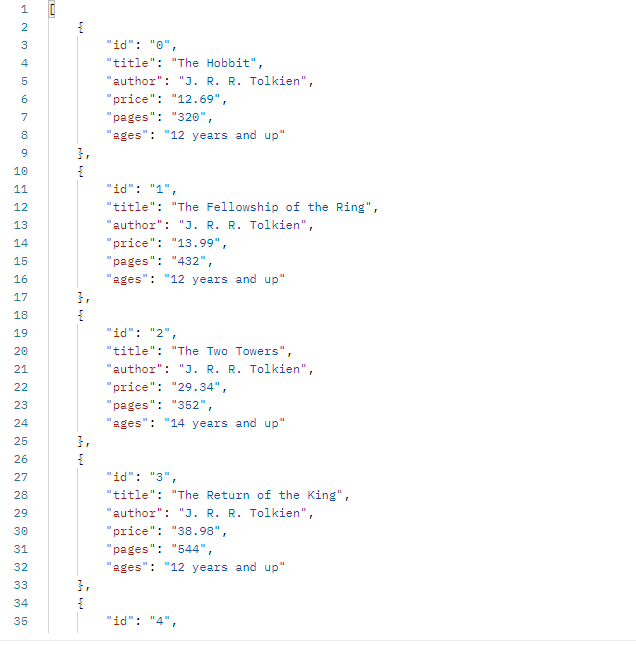

# Book Directory

## Back End Application

## Purpose

I built this application to further my experience when working with Node.js. After completing a Udemy Course teaching vanilla JavaScript routes using Node.js I went ahead and built a book directory. This is a Back End Application and requires special technologies to use.

## Table of Contents

- [About](#about)
- [Usage](#Usage)
- [License](#license)
- [Author](#author)
- [Badges](#badges)

## About

This application was built using vanilla JavaScript, Node.js, UUID version 4, and Nodemon. While building it I used the MVC pattern (minus the View) to create the logic. This was great practice for me and I now have a deeper appreciation for Express which makes a developer's life a little bit easier.

## Usage

With this project being a Back End Application you'll need a third party application to use it properly. There are several different to choose from but I went with [Postman](https://www.postman.com/). To properly use this application you will need to:

- download the source code onto your machine
- [download and setup](https://www.youtube.com/watch?v=VywxIQ2ZXw4&t=44s) Postman
- start the server on your machine
  = using [GitBash](https://www.youtube.com/watch?v=pIbxvTsjqLw)
  - navigate to the projects root directory
  - run "npm i" to install dependencies
  - run "npm run dev" to start the server
- use Postman to perform CRUD operations

## License

MIT License

Copyright (c) [2021] [David Whipple]

Permission is hereby granted, free of charge, to any person obtaining a copy
of this software and associated documentation files (the "Software"), to deal
in the Software without restriction, including without limitation the rights
to use, copy, modify, merge, publish, distribute, sublicense, and/or sell
copies of the Software, and to permit persons to whom the Software is
furnished to do so, subject to the following conditions:

The above copyright notice and this permission notice shall be included in all
copies or substantial portions of the Software.

THE SOFTWARE IS PROVIDED "AS IS", WITHOUT WARRANTY OF ANY KIND, EXPRESS OR
IMPLIED, INCLUDING BUT NOT LIMITED TO THE WARRANTIES OF MERCHANTABILITY,
FITNESS FOR A PARTICULAR PURPOSE AND NONINFRINGEMENT. IN NO EVENT SHALL THE
AUTHORS OR COPYRIGHT HOLDERS BE LIABLE FOR ANY CLAIM, DAMAGES OR OTHER
LIABILITY, WHETHER IN AN ACTION OF CONTRACT, TORT OR OTHERWISE, ARISING FROM,
OUT OF OR IN CONNECTION WITH THE SOFTWARE OR THE USE OR OTHER DEALINGS IN THE
SOFTWARE.

## Author

Hello! My name is David.  
Email me at dwhipp88@gmail.com.  
Or visit my [LinkedIn](https://www.linkedin.com/in/david-w-079841213/)  
If you're interested in seeing more of my work then check out my [portfolio](http://mighty-brook-32674.herokuapp.com/) or you can view my [github](https://github.com/D-Whipp).

## Badges

